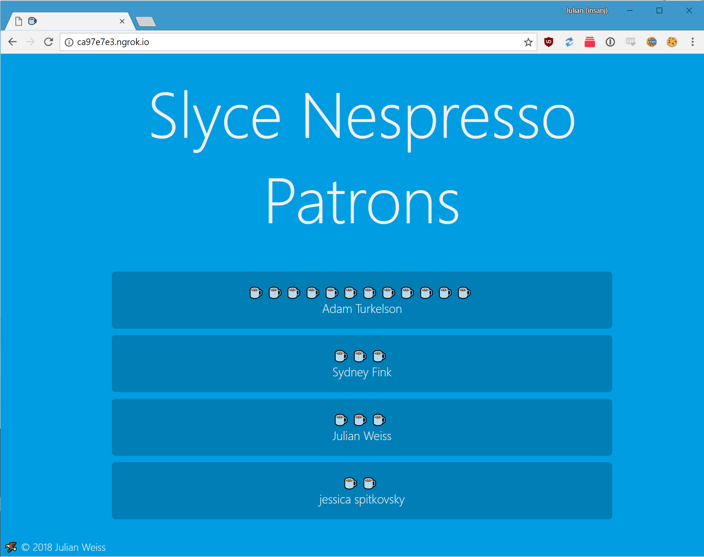



   
   <h3 align="center">julian.coffee</h3>
   <h4 align="center">python bot that crawls slyce nespresso patrons via venmo</h4>

## Built with

- [python/cpython](https://github.com/python/cpython)
- [pallets/flask](https://github.com/pallets/flask)
- [jquery/jquery](https://github.com/jquery/jquery)
- [selenium](https://pypi.org/project/selenium/)
- [twilio](https://www.twilio.com/)

## License

See [LICENSE](LICENSE). Please reach out to me on [🐤 Twitter](https://twitter.com/insanj) or [🚀 GitHub](https://github.com/insanj) if you'd like to use julian.coffee for something cool!
